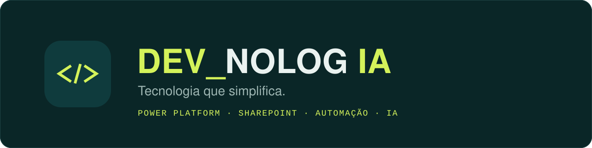

  

<h3 align="center">Olá, sou o Lucas 👋</h3>

  Desenvolvedor sênior de <b>Power Platform</b> e <b>SharePoint</b>, fundador da <b>DEVNOLOGIA</b>. 
  Mais de 10 anos no ecossistema Microsoft, com projetos no Brasil e na Europa. Baseado no Porto 🇵🇹

  
  
  

<h3>&lt;/&gt; O que faço</h3>

<table>
  <tr>
    <td width="50%"><b>📱 Apps de gestão</b> Power Apps (Canvas e Model-Driven) sobre Dataverse e SharePoint.</td>
    <td width="50%"><b>⚡ Automação de processos</b> Power Automate e RPA: menos trabalho manual, menos erros.</td>
  </tr>
  <tr>
    <td><b>🏢 Intranets e portais</b> SharePoint Online e web parts em SPFx + React.</td>
    <td><b>🤖 Automação inteligente</b> IA aplicada a processos: OCR, extração de dados e decisões automáticas.</td>
  </tr>
  <tr>
    <td><b>📊 Dados e dashboards</b> Power BI ligado aos dados do negócio.</td>
    <td><b>🔧 Sob medida</b> Integrações via API, ALM com Azure DevOps e Git.</td>
  </tr>
</table>

<h3>&lt;/&gt; Stack</h3>

  
  
  
  
  
  
  
  
  
  
  
  
  

<h3>&lt;/&gt; Como trabalho</h3>

<ul>
  <li><b>Simples primeiro</b> · a solução mais simples que resolve.</li>
  <li><b>Feito junto</b> · construída com quem vive o processo.</li>
  <li><b>Rastreável</b> · documentado, sem depender de uma pessoa.</li>
  <li><b>Feito para durar</b> · ALM, versionamento e treinamento da equipe.</li>
</ul>

<b>DEV_NOLOG IA</b> · Tecnologia que simplifica.

